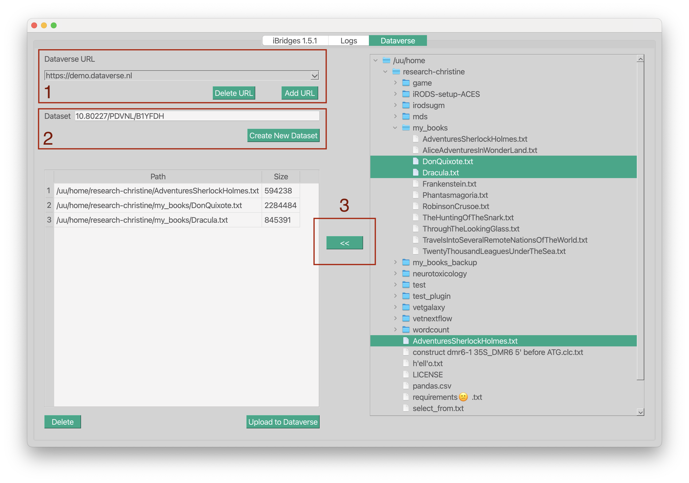

# iBridges Dataverse

This package provides a plugin to iBridges CLI. The plugin allows to create a dataset on Dataverse and to uplaod iRODS data objects.

## Dependencies

- Python 3.9 or higher
- HTTPX
- PyDataverse
- iBridges

All packages are installable with pip. 

## Install plugin

```
pip install git+https://github.com/iBridges-for-iRODS/ibridges-plugin-dataverse.git
```
This installs the python package `ibridgesdvn`.

When you start the iBridges CLI or shell you will see the following new commands:

```
ibridges -h

    dv-add-file         Mark one or more iRODS data objects to be uploaded to a Dataverse dataset.
    dv-setup            Print existing Dataverse configurations or create new ones.
    dv-create-ds        Create a new dataset in a Dataverse collection.
    dv-init             Provide token and store for future use
    dv-meta-ds          Add or overwrite metadata of a dataset.
    dv-push             Push all local changes to the dataverse collection.
    dv-rm-file          Remove one or more iRODS data objects from upload to a Dataverse dataset.
    dv-status           List all local changes to the dataset(s).
    dv-switch           Switch to another existing Dataverse configuration by providing a url or
                        alias.
```

If you use the iBridges GUI you will be able to select a "Dataverse" view.

## The Dataverse View



- Step 1: Configure your Dataverse Connection
	You can add new configurations or delete old ones.
- Step 2: Select a Dataverse collection to which files should be uploaded.
	If you do not have a dataset yet, use the
	"Create New Dataset" button and get a DOI to a newly created dataset.
- Step 3: Select iRODS data objects from the right pane of the view.
	With the button "<<" they will be added to the list of data that will be uploaded.
	You can also delete one or several entries from the list.

When you are happy with the list, click "Upload to Dataverse". Now go to your Dataverse dataset in the browser and finish you data publication.


## The Dataverse commands

### Configuring a Dataverse instance

With the command `ibridges dv-setup` you can see all existing Dataverse URLs and you create an alias for a Dataverse URL.

```
ibridges dv-setup dvnl-demo https://demo.dataverse.nl
```

To activate this environment you need to provide an API token:

```
ibridges dv-init dvnl-demo
Your Dataverse token for dvnl-demo :
  demo -> https://demo.dataverse.org
* dvnl-demo -> https://demo.dataverse.nl
```

Your token will not be shown, but stored for future use.

You see that there are two Dataverse URLs. You can switch between them with:

```
ibridges dv-switch https://demo.dataverse.org
* demo -> https://demo.dataverse.org
  dvnl-demo -> https://demo.dataverse.nl
```

**In all of those commands you can use the URLs and the aliases interchangeably.**

**Note, that those commands are only available for the CLI and not for the shell. All other commands can be used from the shell.**

### Creating a dataset

To create a dataset, you will need a specific Dataverse dataset.json which you can provide like this:

```
ibridges shell
ibshell:research-christine> dv-create-ds UUscience --metajson ibridgescontrib/ibridgesdvn/dataset.json
Dataset with pid 'doi:10.80227/PDVNL/RZQRAK' created.
```
This creates a dataset on the Dataverse we selected with `dv-init` or `dv-switch`, it uses the Dataverse collection `UUscience`. Please adjust to your Dataverse instance. 
You will need the `10.80227/PDVNL/RZQRAK` part of the pid to add files and to finally upload them to Dataverse, so please save it somewhere.

### Browsing files and adding it to Dataverse

After you created the new Dataset on Dataverse, you can now use the iBridges shell to browse and add files as you go along.

We implemented a git-like workflow. So the following command will only mark files to be uploaded to Dataverse.


Browse through collections in iRODS

```
ibshell:research-christine> ls my_books
/uu/home/research-christine/my_books:
  /uu/home/research-christine/my_books/AdventuresSherlockHolmes.txt
  /uu/home/research-christine/my_books/AliceAdventuresInWonderLand.txt
  /uu/home/research-christine/my_books/DonQuixote.txt
  /uu/home/research-christine/my_books/Dracula.txt
```

And select files as you go along:

```
ibshell:research-christine> dv-add-file 10.80227/PDVNL/RZQRAK irods:my_books/AdventuresSherlockHolmes.txt irods:my_books/DonQuixote.txt
```

In the iBridges CLI and shell you can use relative iRODS paths. All iRODS paths need to be prefixed with `irods:`.

You will receive a short summary of all files that you ever marked for upload. This summary also contains all Datavers instances you work on and all Datasets:

```
{'https://demo.dataverse.nl': {'add_file': [{'dataset': '10.80227/PDVNL/RZQRAK',
                                             'irods_paths': ['/uu/home/research-christine/my_books/AdventuresSherlockHolmes.txt',
                                                             '/uu/home/research-christine/my_books/DonQuixote.txt']}]}}

``` 

You can also remove iRODS paths again with:

```
ibshell:research-christine> dv-rm-file 10.80227/PDVNL/RZQRAK irods:my_books/DonQuixote.txt
```

And with `dv-status` you can check which files are marked for upload:

```
ibshell:research-christine> dv-status
{'https://demo.dataverse.nl': {'add_file': [{'dataset': '10.80227/PDVNL/RZQRAK',
                                             'irods_paths': ['/uu/home/research-christine/my_books/AdventuresSherlockHolmes.txt']}]}}
```

### Upload data to dataset

Now that you are happy with the marked data, upload them to the dataset:

```
ibshell:research-christine> dv-push 10.80227/PDVNL/RZQRAK

Data stored in /Users/staig001/.dvn/data
/uu/home/research-christine/my_books/AdventuresSherlockHolmes.txt
100%|████████████████████████████████████████████████████████████████| 580k/580k [00:00<00:00, 1.01MB/s]
Downloaded /uu/home/research-christine/my_books/AdventuresSherlockHolmes.txt --> /Users/staig001/.dvn/data/AdventuresSherlockHolmes.txt
{'pid': 'doi:dataset_id', 'filename': 'AdventuresSherlockHolmes.txt'}
Uploaded /Users/staig001/.dvn/data/AdventuresSherlockHolmes.txt --> 10.80227/PDVNL/RZQRAK
```

A successful download and upload will trigger that those files will be removed from the status.

```
ibshell:research-christine> dv-status
{'https://demo.dataverse.nl': {'add_file': [{'dataset': '10.80227/PDVNL/RZQRAK',
                                             'irods_paths': []}]}}
```


